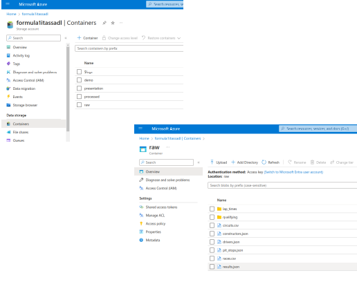
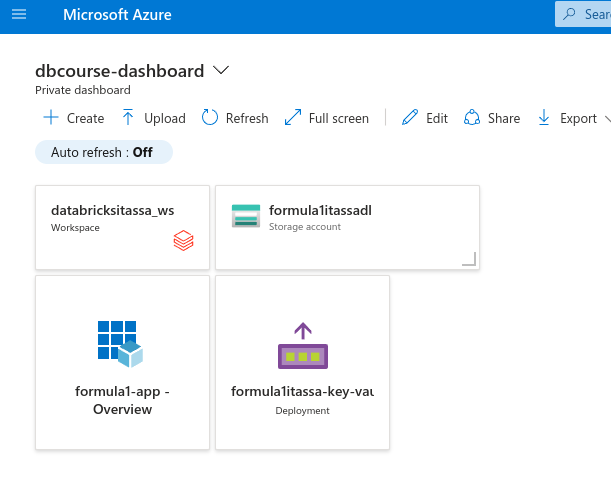
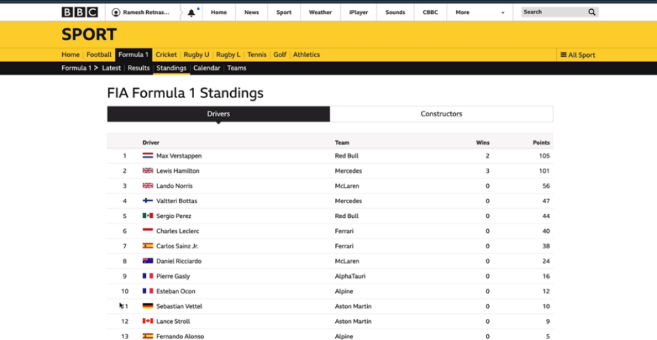
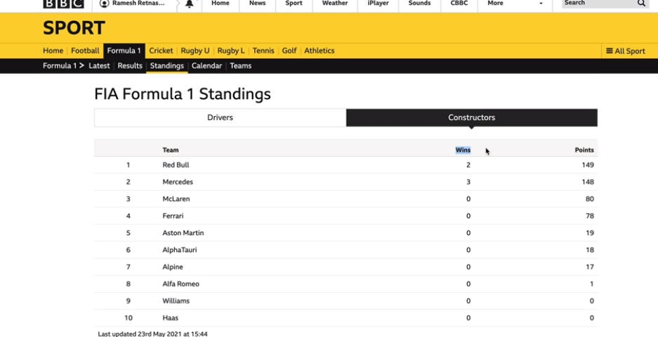

# AzureDatabricks_formula1
This repository host the code used to generate Data Analysis on Azure Databricks over the Formula1 data getting by Ergast API (https://ergast.com/mrd/).

# From the Ergast API
## Data model
The Ergast API provided data of Formula1 over this data model:

## The data on Azure Account Storage 
We create a Azure Storage account to save user data, and organize it using Medalion Architeture:

## Acessing Azure Account Storage from Databricks
In order to access the user data from storage account, we've created a service aplication and used a Key Vault to save the secrets. So our project in databricks have this components:

## Mounting the paths using Service Authentication
We've create a Scope on Databricks and one function to use a Service Principal authentication to mount the paths. This way we can use relative paths instead of the whole path using the abfs protocol.
[Mounting Paths](environment)

## Files Ingestion
The ingestion of files were done in separated notebooks. 
[Ingestion folder](ingestion)

## Goals of the tranformations
First goal was to create a parquet file with the information that could be consumed to feed web pages as shown in the next images.

## The drivers standings file
We've created a parquet file using the notebook 1.transforming_driver_standing.py, in that was create a rank of drivers using Window functions. [driver_standings](transformation)

